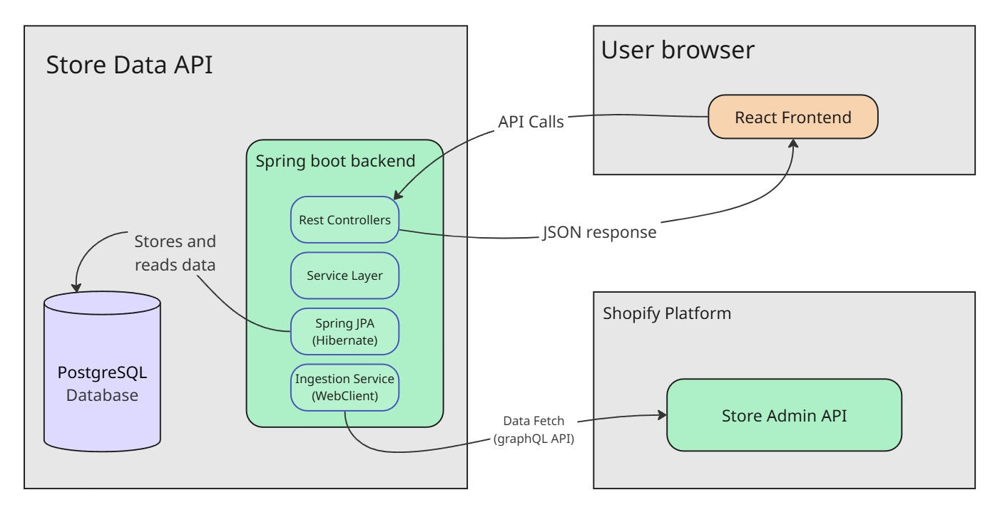

# Shopify Data Analytics API


This project is the backend service for a Shopify Data Analytics application. It connects to the Shopify Admin API to fetch store data, processes it, and exposes a secure RESTful API for a front-end client.

## About The Project

This application was developed to provide Shopify store owners with a simple, clear interface to analyze their sales data. It allows users to connect multiple stores and view key metrics and trends.

- **Deployed Link for swagger docs:** [https://storedataapi-production.up.railway.app/api](https://storedataapi-production.up.railway.app/api)
- **Frontend Repository:** [https://github.com/LavaCandy1/ShopifyAnalyticsApp](https://github.com/LavaCandy1/ShopifyAnalyticsApp)
- **Deployed Frontend Link:** [https://shopify-analytics-app.vercel.app](https://shopify-analytics-app.vercel.app)

---

###  Key Features

- **Multi-Store Support:** A single user can register and connect multiple Shopify stores.
- **Secure Authentication:** User registration and login handled using Spring Security.
- **Data Ingestion:** Fetches and stores key data points from Shopify, including Orders, Products, and Customers.
- **On-Demand Sync:** Ability to trigger a data synchronization process for any connected store.
- **Analytics API:** Provides aggregated data for KPIs (Key Performance Indicators), top customer lists, and time-series charts.

---

###  Built With

- **[Java 17](https://www.oracle.com/java/technologies/javase/jdk17-archive-downloads.html)**
- **[Spring Boot 3](https://spring.io/projects/spring-boot)**
- **[Spring Security](https://spring.io/projects/spring-security)**
- **[Spring Data JPA (Hibernate)](https://spring.io/projects/spring-data-jpa)**
- **[PostgreSQL](https://www.postgresql.org/)**
- **[Maven](https://maven.apache.org/)**
- **[Spring WebClient](https://docs.spring.io/spring-framework/docs/current/reference/html/web-reactive.html#webflux-client)** (for calling the Shopify API)
- **[Swagger/OpenAPI 3](https://swagger.io/)** (for API documentation)

---

### Architecture

The application follows a standard layered architecture, as shown below. It separates concerns between the API controllers, business logic (service layer), and data persistence (JPA repository).



---

## Getting Started

To get a local copy up and running, follow these simple steps.

### Prerequisites

You will need the following :

- Java (JDK) 17 or later
- Maven or Gradle
- A running instance of PostgreSQL
- A [Shopify Partner Account](https://www.shopify.com/partners) to create a development store and app.

### Installation & Setup

1.  **Clone the repository:**

    ```sh
    git clone [https://github.com/LavaCandy1/StoreDataAPI]
    ```

2.  **Configure the database:**

    - Log in to PostgreSQL and create a new database for this project.
    - Example: `CREATE DATABASE shopify_analytics_db;`

3.  **Set up environment variables:**

    - Navigate to `src/main/resources/`.
    - Open the `application-local.properties` file and update the following values with your local configuration.

    ```properties
    # ---------------------------------
    # DATABASE CONFIGURATION
    # ---------------------------------
    spring.datasource.url=jdbc:postgresql://localhost:5432/shopify_analytics_db #or you db name in place of shopify_analytics_db
    spring.datasource.username=[Your_Postgres_Username]
    spring.datasource.password=[Your_Postgres_Password]

    spring.jpa.hibernate.ddl-auto=update

    ```

4.  **Build and run the application:**

    ```sh
    # Build the project
    mvn clean install

    # Run the application
    mvn spring-boot:run
    # or run the StoreDataApiApplication.java file from src/main/java/com/AyushGarg/StoreDataapi/
    ```

The API server should now be running on `http://localhost:8000`.

---

### 📖 API Documentation

This API is documented using OpenAPI 3. Once the application is running, you can view the interactive Swagger UI to see all available endpoints and test them directly from your browser. It is currently served at base URL of the applicaiotn (i.e. /api)

- **Swagger UI URL:** [http://localhost:8000/api](http://localhost:8000/api)

---

### 🧑‍💻 Contact

Ayush Garg – `https://www.linkedin.com/in/ayushgarg-17lc` – `aayush.garg.1793@gmail.com`
